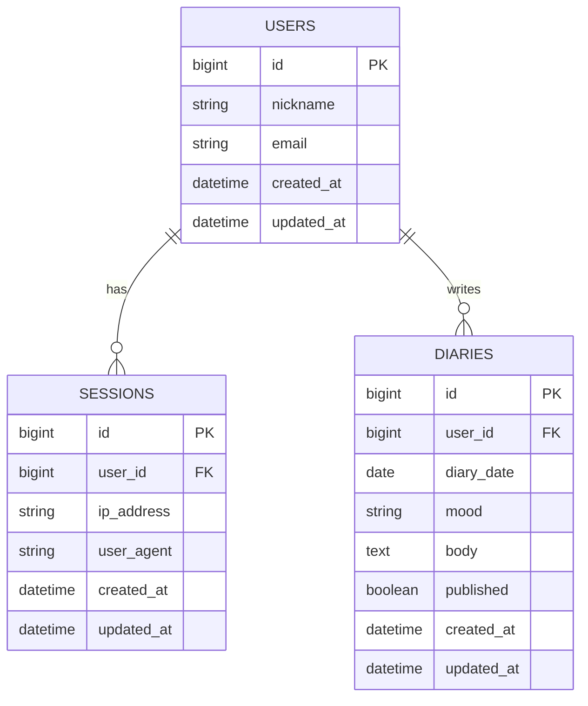

```mermaid
erDiagram
    USERS ||--o{ SESSIONS : has
    USERS ||--o{ DIARIES : writes

    USERS {
        bigint id PK
        string nickname
        string email
        datetime created_at
        datetime updated_at
    }

    SESSIONS {
        bigint id PK
        bigint user_id FK
        string ip_address
        string user_agent
        datetime created_at
        datetime updated_at
    }

    DIARIES {
        bigint id PK
        bigint user_id FK
        date diary_date
        string mood
        text body
        boolean published
        datetime created_at
        datetime updated_at
    }
```
